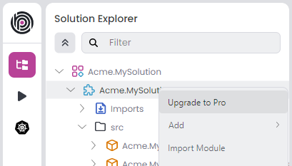

# Migrating from Open Source Templates

ABP Studio provides a way for users, who already started the development before purchasing a license, to auto-upgrade their solutions with Pro modules. You can use this functionality through ABP Studio UI or ABP Studio CLI:

* A new button labeled `Upgrade to Pro` will be visible if you have a license but the current solution is created with open-source (free) license.



* Alternatively, you can use the following ABP Studio CLI command to achieve the same functionality:

  ```bash
  abp upgrade [-t <template-name>] [options]
  
  Examples:
  
  abp upgrade -t app
  abp upgrade -t app --language-management --gdpr --audit-logging-ui --text-template-management --openiddict-pro
  abp upgrade -t app-nolayers --audit-logging-ui
  abp upgrade -t app-nolayers -p D:\MyProjects\MyProject
  ```

## Changes in the solution

### Module changes

This command will remove the following modules from your solution:

- Volo.Abp.Account
- Volo.Abp.Identity
- Volo.Abp.TenantManagement
- Volo.Abp.LeptonXLiteTheme

And install the following modules to your solution:

- Volo.Abp.Account.Pro
- Volo.Abp.Identity.Pro
- Volo.Abp.LeptonXTheme
- Volo.Saas
- Volo.Abp.OpenIddict.Pro (*Optional*)
- Volo.Abp.AuditLogging.Pro  (*Optional*)
- Volo.Abp.LanguageManagement  (*Optional*)
- Volo.Abp.TextTemplateManagement  (*Optional*)
- Volo.Abp.Gdpr  (*Optional*)

### Other changes

The command will also do the following changes in your solution:

- It will add `nuget.abp.io` NuGet source to `NuGet.config` file.
- It will create or update `appsettings.secrets.json` files to place the license key needed for Pro module usage.
- It will update the database. (And it will create a new migration if the solution uses EntityFramework Core)
- It will run `install-libs` command at the end.

## Things to pay attention before using

- The command covers the most common scenarios, but there is still a possibility that it can mess up something in your solution. Therefore, we strongly recommend a version control system (like [Git](https://git-scm.com)) to track what is changed in your solution and revert if needed.
- The command will not remove your custom codes that may be related with the removed modules listed above. So there may be build errors if you referenced one of those modules. You can clear them manually.
